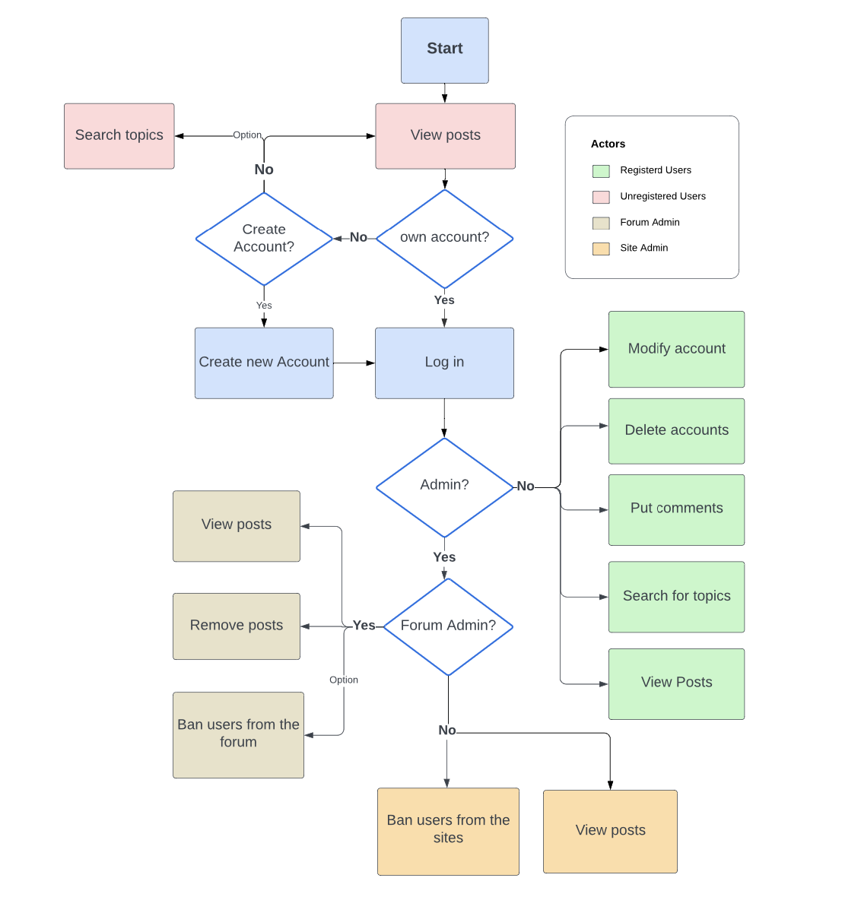
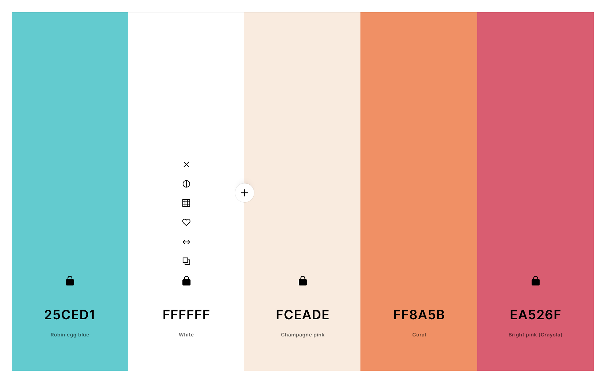
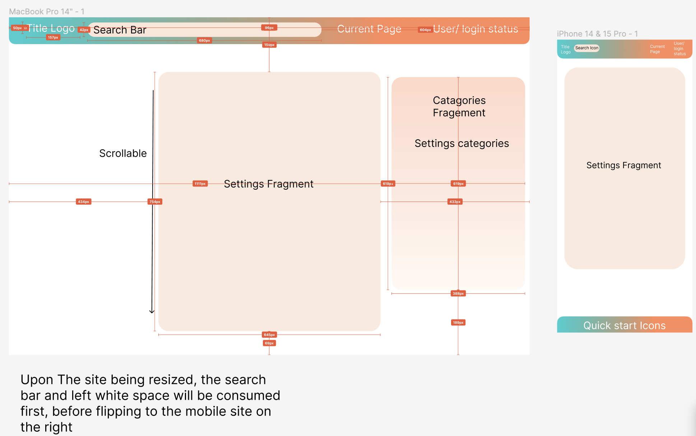
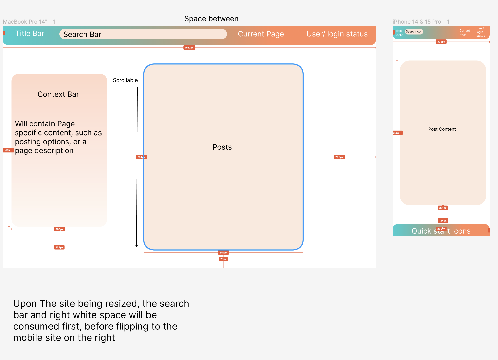
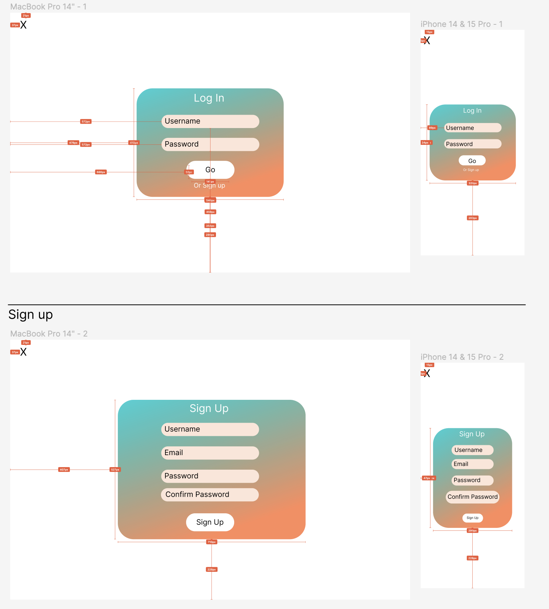

# Design Document

## Logic process:

## Site Map:

## Stylistic choices:
When designing the site, we thought about typical webapp and website that use basic color pallettes with one color to pop. We decided that using a gradient would leave us with some wiggle room around color usage and creating logos. 
To pick our colors we use a site called coolors and settled on this scheme

The rest of our general stylings can be seen in style.css as these are our general guidelines for building pages and features for the site

## Figma Designs

### Settings/Profile page

This page is built to be populated with different sets of data from the database depending on its usage. so we built it as a general page. for example when viewing settings, the right column can be populated with catagories that link to parts of the page. or when viewing a general forum the side could be specific settings or moderator abilities.

### Home Page

When Designing the home page we first thought about where people would be using the site. so we specifically designed two ways the site could be used. One on mobile and one on desktop. The Usage of the side menu for desktop and the bottom menu for mobile felt like a really good way to frame content in a way that users would not be missing out on anything
### Account Creation/Login

Simplicity was our goal when designing these pages, mostly because we wanted signing up or logging in to be a really seemless experience. You never want to drive users away at the sign up page. 

## Site Examples are available on our github
[Visit Github](https://github.com/Sk3tch7y/360-Project/tree/main/Project%20Documents)